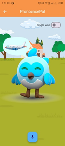

# 📱 PronouncePal - Urdu Pronunciation & Speech Improvement App

PronouncePal is an innovative **language learning and speech improvement app** designed specifically for children, with a primary focus on refining **Urdu pronunciation**. Built using **Flutter**, the app uses advanced **speech recognition** and interactive animated characters to deliver a fun, personalized, and educational experience.

---

## ✨ Features

- 🗣️ Real-time Urdu pronunciation feedback using speech recognition
- 🧒 Age-specific learning modes (e.g., toddlers, early learners, school-aged kids)
- 🎨 Animated character for engaging interactions
- 🔐 Secure and private: multiple user profiles on a single device
- 🧑‍👩‍👧‍👦 Family-oriented design with no data shared to external services
- 🧠 Adaptive learning to help improve speech therapy outcomes

---

## 🚀 Getting Started

### Prerequisites

- Flutter SDK (>= 3.10.0)
- Dart SDK (>= 3.0.0)
- Android Studio / Xcode
- Device/emulator with microphone permissions enabled

### Installation

1. Clone the repository:
   ```bash
   git clone https://github.com/your-username/pronouncepal.git
   cd pronouncepal
   flutter pub get
   flutter run

## 📸 Screenshots & App Preview

A preview of the app UI is available in the [`screenshots/`](./screenshots) folder.

| Home Screen | Practice Mode | Feedback View |
|-------------|----------------|----------------|
|  |  

> 📝 **Note:** All app preview images are stored in the `screenshots/` folder located in the root of this project.

  
  
